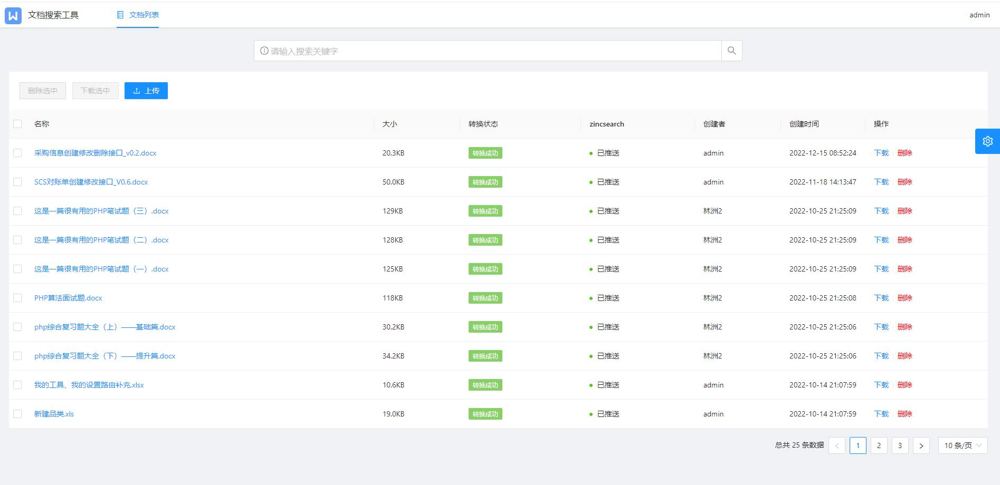
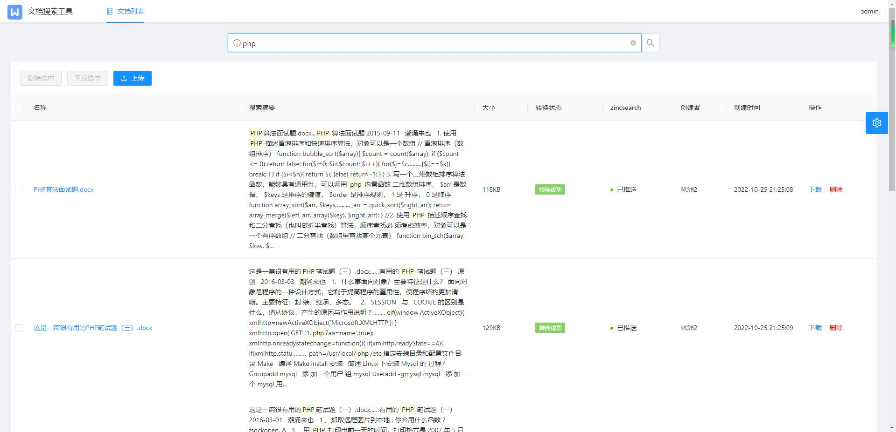

# 文档搜索工具

### 特性

- 后端：thinkphp框架 前端：ant design pro V5
- 搜索引擎：轻量级全文搜索引擎zincsearch
- 文档转换工具：LibreOffice
- 主要功能模块：文件上传下载、文档内容全文搜索

### 安装

```
//克隆代码
git clone https://github.com/luler/hello_document.git
//进入代码跟目录，使用docker-compose启动项目
docker-compose up -d
```

### 访问

容器运行成功后，访问：http://ip:3322/
初始账号: admin 密码: admin

> 临时在线试用参考：https://cas.luler.top/?search=6348f0f641ba3

### 使用截图




